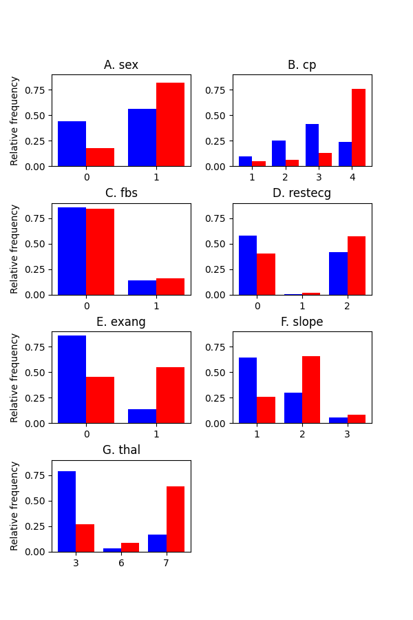

# Heart Disease Detection with Feedforward Neural Networks

Chris Monit, summer 2020

In this personal project, I implemented feedforward neural networks of arbitrary size from scratch, including manual calculation of gradients. It was an exercise to consolidate learnings from Andrew Ng's Deep Learning Specialisation course.

The project is framed as developing a diagnostic test for individuals suffering from heart disease using indirect measurements. This report includes an exploratory data analysis, descriptions of the models, evaluations of model performance on held-out data and a discussion of how the models could be improved.

## Background
Coronary heart disease (CHD) affects 2.3 million people and is responsible for 64,000 deaths annually in the UK (<a id="bhf" href="https://www.bhf.org.uk/what-we-do/our-research/heart-statistics">British Heart Foundation</a>). It is caused by aggregation of fatty deposits in the coronary arteries and normally diagnosed by electrocardiogram or chest x-ray, but using machine learning it may be possible to accurately identify CHD from indirect measurements such as blood tests and patient reported symptoms, saving time and costs.

Here we investigate the predictive potential of shallow neural networks in identifying CHD from the commonly studied <a id="bhf" href="https://archive.ics.uci.edu/ml/datasets/Heart+Disease">Cleveland dataset</a>, comprising 13 measurements from 303 patients, together with a ground truth labels indicating 'CHD' (139 patients) or 'no CHD' (164 patients). Therefore we approach CHD diagnosis as a binary classification problem.

## Results
### Investigating features

The data comprise six quantitative (or ordinal) and seven categorical features, defined in the table below. Firstly, we investigate whether there is discriminatory signal in these variables which might inform a classification model. Visualising the features by presence/absence of CHD reveals clearly distinct distributions for some but not all measurements:

But are these differences statistically significant? We applied the two-sided Mann-Whitney U test for the six quantitative features, as this is a nonparametric test that requires no assumption about the underlying distributions, while for the seven categorical variables we apply Pearson's chi squared test. We reject the null hypothesis of identical distributions if _p_ < 0.05. With 13 features to investigate, performing multiple hypothesis tests increases the danger of type 1 error and therefore adjust the resulting _p_ values using the Bonferroni correction (arguably the most conservative of correction procedures) and retain the 0.05 threshold (values to 5 decimal places):

| feature   | description                           | test   |   statistic |       p |   p_bon | p_bon < 0.05   |
|:----------|:--------------------------------------|:-------|------------:|--------:|--------:|:---------------|
| age       | Age in years                          | MW-U   |   8274.5    | 4e-05   | 0.00051 | Yes            |
| trestbps  | Resting blood pressure                | MW-U   |   9710      | 0.02597 | 0.33764 | No             |
| chol      | Serum cholestoral                     | MW-U   |   9798.5    | 0.03536 | 0.45967 | No             |
| thalach   | Max. heart rate                       | MW-U   |  16989.5    | 0       | 0       | Yes            |
| oldpeak   | Exercise-induced ST depression        | MW-U   |   6037      | 0       | 0       | Yes            |
| ca        | Number of major vessels               | MW-U   |   5711.5    | 0       | 0       | Yes            |
| sex       | Sex                                   | chi2   |     22.0426 | 0       | 3e-05   | Yes            |
| cp        | Chest pain type                       | chi2   |     81.8158 | 0       | 0       | Yes            |
| fbs       | Fasting blood sugar                   | chi2   |      0.0771 | 0.78127 | 1       | No             |
| restecg   | Resting electrocardiography           | chi2   |     10.0515 | 0.00657 | 0.08536 | No             |
| exang     | Exercise induced angina               | chi2   |     54.6864 | 0       | 0       | Yes            |
| slope     | Slope of the peak exercise ST segment | chi2   |     45.7846 | 0       | 0       | Yes            |
| thal      | Thallium scan result                  | chi2   |     82.6846 | 0       | 0       | Yes            |

We concluded there is significant discriminatory signal among the majority of features which may be useful for CHD classification.

Computing Kendall's rank correlation coefficient between features (with categorical features transformed to quantative using one hot encoding), showed there is not an overwhelmingly strong correlation between any of the features:

    

### Binary classification neural network models

#### Models
We evaluated a set of fully connected, feedforward neural network architectures with up to two hidden layers using hyperbolic tangent ('tanh') activation functions and an output layer comprising a single sigmoid unit. The complexity of the networks ranged from no hidden units (i.e. logistic regression) to two hidden layers, comprising up to 16 units each. We use the notation '1', 'n_1' or 'n_m_1' to represent networks comprising zero, one or two hidden layers comprising n or m units each, with a single sigmoid output unit (see figure). Weight and bias parameters were determined by 10,000 iterations of standard, batch gradient descent using the cross entropy cost function, with a range of learning rate (alpha) values. Squared Frobenius norm (matrix L2 norm) regularisation for weight parameters was used to limit overfitting to training data, with a range of regularisation parameter (lambda) values.

    

#### Model training and validation

All 13 features were used, with categorical features transformed into multiple binary features using one hot encoding (see methods). 20% of the total dataset was uniformly randomly subsampled, preserving the proportions of CHD and non-CHD cases, and reserved as a test set. The remaining 80% was used for hyperparameter tuning using 4-fold cross validation, by uniformly randomly subsampling 4 non-overlapping validation sets and for each of these using the remaining 3 folds for training each model, before measuring the models' performances on the given validation set. Proportions of CHD and non-CHD cases were preserved amongst folds. Area under the ROC curve (AUC) was chosen as a performance metric to compare models, as this summarises the compromise between a model's sensitivity and specificity. For each experimental condition the mean AUC was calculated across the 4 validation folds.

The figures below summarise the influence of hyperparameters on mean ROC AUC from 4-fold cross validation, on both the training and validation sets, over a range of hyperparameter values:

    

    Hyperparameter grid search, mean AUC on cross validation training datasets. 

    

    Hyperparameter grid search, mean AUC on cross validation validation datasets. 

While there is considerable overfitting to the training sets, nonetheless there is respectable performance on the validation sets for most models. However, several of the models comprising two hidden layers have failed to learn, in particular with lower learning rates. This same grid search was attempted using ReLU activation functions for units in each hidden layer, but these had poorer performance outcomes (data not shown). 

Performance metrics of the five (tanh-activation) models with highest ROC AUC are shown below ('arch.', model architecture; 'alpha', learning rate; 'reg', regularisation parameter; 'roc_auc', area under the ROC curve; 'sens.', sensitivity, 'spec.', specificity', 'acc.', accuracy):

|   arch. |   alpha |   reg |   roc_auc |   sens. |   spec. |   acc. |
|--------:|--------:|------:|----------:|--------:|--------:|-------:|
|     2_1 |     1   |   0   |    0.869  |  0.8806 |  0.8574 | 0.8677 |
|   2_2_1 |     0.5 |   0   |    0.8613 |  0.8806 |  0.842  | 0.8593 |
|     2_1 |     0.5 |   0   |    0.8596 |  0.8621 |  0.8572 | 0.8593 |
|   2_2_1 |     0.1 |   0   |    0.8513 |  0.8528 |  0.8498 | 0.851  |
|   2_4_1 |     0.1 |   0.5 |    0.8486 |  0.8251 |  0.8721 | 0.851  |

We then pursued a finer grid search over a narrower range of values in this high-performing region of the hyperparameter space, and measured model performance as before:

The five highest performing models were as follows: 

|   arch. |   alpha |   reg |   roc_auc |   sens. |   spec. |   acc. |
|--------:|--------:|------:|----------:|--------:|--------:|-------:|
|     2_1 |     1.1 |     0 |    0.8728 |  0.8806 |  0.865  | 0.8719 |
|   2_2_1 |     0.8 |     0 |    0.8697 |  0.8899 |  0.8496 | 0.8676 |
|     2_1 |     1   |     0 |    0.869  |  0.8806 |  0.8574 | 0.8677 |
|     2_1 |     1.2 |     0 |    0.869  |  0.8806 |  0.8574 | 0.8677 |
|     2_1 |     0.9 |     0 |    0.8644 |  0.8714 |  0.8574 | 0.8635 |

This suggested the optimum model had architecture '2_1', learning rate 1.1 and without any regularisation term'.

#### Test set performance

We then trained this optimum model on the whole training/validation set (i.e. pooling all 4 CV folds) and evaluated its performance on the test set by the same metrics:

| dataset |   arch. |   alpha |   reg |   roc_auc |   sens. |   spec. |   acc. |
|:--------|--------:|--------:|------:|----------:|--------:|--------:|-------:|
| test    |     2_1 |     2.1 |     0 |    0.8054 |  0.9333 |  0.6774 | 0.8033 |

Plotting the ROC curve using the range of available thresholds:

    

## Discussion

In this project, we have investigated the capability of several simple neural networks to correctly classify patients as suffering from CHD, based on a range of indirect measurements. 

The most promising model on the basis of cross validation experiments proved to be a network with a single hidden layer, trained with a relatively high learning rate and without regularisation. Training this model with the whole training set and evaluating performance on unseen data yielded a high AUC, suggesting performance could generalise well to unseen data. However, the balance between sensitivity and specificity was considerably different from the values seen in the CV experiments, having more impressive sensitivity at the cost of lower specificity. A limitation of the project as a whole is the uncertainty surrounding the performance levels required in practice for the model to be useful, since this is a toy problem.

Almost all models showed considerable overfitting of the training set and squared Frobenius-norm regularisation provided minimal benefit to the top performing models. It is possible that other regularisation techniques could allow the more complex models to increase their CV performance, such as dropout regularisation if stochastic gradient descent were implemented. 

Several implementation strategies could have improved training and allowed more efficient model development. Here we have applied a standard, batch gradient descent algorithm to learn weight and bias parameters but there may have been benefit from applying stochastic (mini-batch) gradient descent, where updates to parameters are determined using random, smaller subsets of the data at a time. Additional augmented search algorithms such as Adam (adaptive momentum estimation), which help maintain efficient training despite the stochastic exposure to training examples, may have had further benefit in this scenario.

However, even more straightforward changes may have improved efficiency. During hyperparameter tuning, we applied a single learning rate for each model being trained, but allowing the learning rate to decrease as a function of gradient descent iterations may have improved exploration of the parameter space close to the cost function's global minimum. Secondly, since several relatively simple models hardly improved performance at all during training, which may have been due to unfavorable initial parameter values, it may have been beneficial to randomly resample initial parameter values after a given number of gradient descent iterations if little change in the cost was observed. Indeed the number of gradient descent iterations used (10,000) was arbitrary and a more sensible approach may be to define the stopping point flexibly, for example by measuring change in the cost and terminating training once further improvement was unlikely.

## Methods

### Implementation and model experiments
All source code can be found in this repository. Models and optimisation algorithms have been implemented from scratch in pure Python, using standard numerical libraries, namely numpy, pandas and sci-kit learn.

Initial weight parameters were sampled from a normal distribution with mean 0 and standard deviation 0.01; bias parameters were all initialised as 0.

### Data Preprocessing

#### Missing data
Features 'ca' and 'thal' (blood vessels and thallium scan) have four and two missing entries respectively, of 303 records in total. Since 'thal' is categorical and ‘ca’ is ordinal, we impute missing values using the modal value for each feature.

#### Ground truth labels
The dataset's documentation is somewhat ambiguous regarding the ground-truth labelling with/without heart disease. It states that value 0 represents < 50% vessel diameter narrowing, while value 1 represents > 50% diameter narrowing; however, additional values are found in this column with the following frequencies:

| Value     | 0   | 1  | 2  | 3  | 4  |
|-----------|-----|----|----|----|----|
| Frequency | 164 | 55 | 36 | 35 | 13 |

In the absence of expert opinion, we have assumed categories 2-4 also represent disease states, as others have previously (e.g. https://gallery.azure.ai/Experiment/Heart-Disease-Prediction-5), yielding 164 ‘no disease’ cases and 139 ‘disease’ cases. While there is a relatively small imbalance in the samples for each class, this inequality should not affect the accuracies of these tests since the absolute number for each class is large.

#### Categorical variables
Seven of the 13 variables are categorical or binary, and therefore not directly suitable for training by neural networks which expect input variables to be continuous. Therefore these seven features were transformed as dummy variables (so called 'one hot encoding') whereby a categorical feature comprising _N_ unique states is replaced with _N_ dummy features, each populated with 1 or 0 depending whether the state is present or absent.

#### Standardising values
Models reliant on large numbers of linear operations, including neural networks, are vulnerable to overly conditioning predictions based on the magnitude or range of some features; but this can be avoided by transforming input features and enforcing a consistent distribution. Following one hot encoding of categorical variables, we scaled training cases such that each feature had mean equal to 0 and variance equal to 1. Each fold's validation set and the test set were transformed by the same procedure as corresponding training data. 

