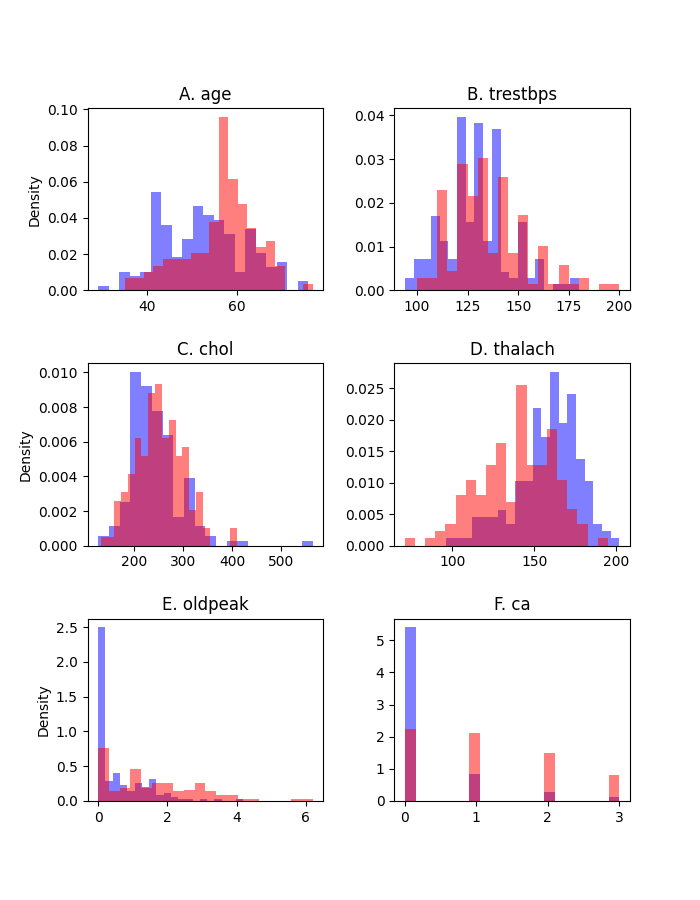

# Heart Disease Detection

Christopher Monit

Summer 2020

## Introduction
Coronary heart disease (CHD) affects 2.3 million people and is responsible for 64,000 deaths annually in the UK (<a id="bhf" href="https://www.bhf.org.uk/what-we-do/our-research/heart-statistics">British Heart Foundation</a>). It is caused by aggregation of fatty deposits in the coronary arteries and normally diagnosed by electrocardiogram or chest x-ray, but using machine learning it may be possible to accurately identify CHD from indirect measurements such as blood tests and patient reported symptoms, saving time and costs.

Here we investigate the predictive potential of shallow neural networks in identifying CHD from the commonly studied <a id="bhf" href="https://archive.ics.uci.edu/ml/datasets/Heart+Disease">Cleveland dataset</a>, comprising 303 records of 13 measurements together with a ground truth labels indicating 'CHD' or 'no CHD'.

## Results
### Investigating features
Firstly, we investigate whether there is discriminatory signal in these variables. 

Visualising the features by presence/absence of CHD reveals clearly distinct distributions for some but not all measurements:

But are these differences statistically significant? We applied the two-sided Mann-Whitney U test for the six quantitative features, as this is a nonparametric test that requires no assumption about the underlying distributions, while for the seven categorical variables we apply Pearson's chi squared test. We reject the null hypothesis of identical distributions if p < 0.05. With 13 features to investigate, performing multiple hypothesis tests increases the danger of type 1 error and therefore adjust the resulting *p* values using the Bonferroni correction (arguably the most conservative of correction procedures) and retain the 0.05 threshold (values to 5 decimal places):

| feature   | description                           | test   |   statistic |       p |   p_bon | p_bon < 0.05   |
|:----------|:--------------------------------------|:-------|------------:|--------:|--------:|:---------------|
| age       | Age in years                          | MW-U   |   8274.5    | 4e-05   | 0.00051 | Yes            |
| trestbps  | Resting blood pressure                | MW-U   |   9710      | 0.02597 | 0.33764 | No             |
| chol      | Serum cholestoral                     | MW-U   |   9798.5    | 0.03536 | 0.45967 | No             |
| thalach   | Max. heart rate                       | MW-U   |  16989.5    | 0       | 0       | Yes            |
| oldpeak   | Exercise-induced ST depression        | MW-U   |   6037      | 0       | 0       | Yes            |
| ca        | Number of major vessels               | MW-U   |   5711.5    | 0       | 0       | Yes            |
| sex       | Sex                                   | chi2   |     22.0426 | 0       | 3e-05   | Yes            |
| cp        | Chest pain type                       | chi2   |     81.8158 | 0       | 0       | Yes            |
| fbs       | Fasting blood sugar                   | chi2   |      0.0771 | 0.78127 | 1       | No             |
| restecg   | Resting electrocardiography           | chi2   |     10.0515 | 0.00657 | 0.08536 | No             |
| exang     | Exercise induced angina               | chi2   |     54.6864 | 0       | 0       | Yes            |
| slope     | Slope of the peak exercise ST segment | chi2   |     45.7846 | 0       | 0       | Yes            |
| thal      | Thallium scan result                  | chi2   |     82.6846 | 0       | 0       | Yes            |

We concluded there is significant discriminatory signal among some features which may be useful for CHD classification.

Computing Kendall's rank correlation coefficient between features (with categorical features transformed to quantative using one hot encoding), showed there is not an overwhelmingly strong correlation between any of the features:

### Classification models
NB using all features

## Conclusions

## Methods

### Models
Details of implementation, optimisation, the hypter parameters that were tweaked etc

### Preprocessing

#### Missing data
Features 'ca' and 'thal' (blood vessels and thallium scan) have four and two missing entries respectively, of 303 records in total. Since 'thal' is categorical and ‘ca’ is ordinal, we impute missing values using the modal value for each feature.

#### Ground truth labels
The dataset's documentation is somewhat ambiguous regarding the ground-truth labelling with/without heart disease. It states that value 0 represents < 50% vessel diameter narrowing, while value 1 represents > 50% diameter narrowing; however, additional values are found in this column with the following frequencies:

| Value     | 0   | 1  | 2  | 3  | 4  |
|-----------|-----|----|----|----|----|
| Frequency | 164 | 55 | 36 | 35 | 13 |

In the absence of expert opinion, we have assumed categories 2-4 also represent disease states, as others have previously (e.g. https://gallery.azure.ai/Experiment/Heart-Disease-Prediction-5), yielding 164 ‘no disease’ cases and 139 ‘disease’ cases. While there is a relatively small imbalance in the samples for each class, this inequality should not affect the accuracies of these tests since the absolute number for each class is large.

#### Categorical variables
One hot encoding

#### Standardising values

## References
<a id="1">[1]</a> 

